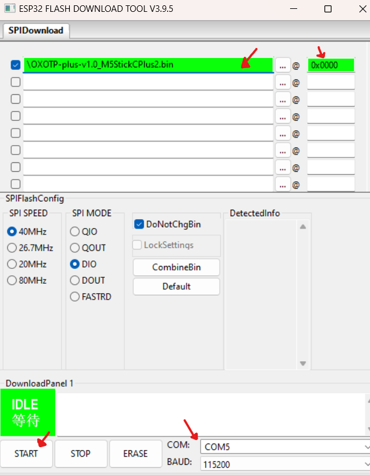

# HOW TO FLASH M5StickC

1. DOWNLOAD <a href="https://www.espressif.com/en/support/download/other-tools" target="_blank">Flash Download Tool</a> 
2. DOWNLOAD the Last Release for your platform here <a href="https://github.com/xick/OXOTP-plus/releases" target="_blank">HERE</a> 
3. Open Flash Download Tool 
4. 

6. 

### Restart your M5StickC after the flash is finished and enjoy it

https://github.com/xick/OXOTP-plus/releases
