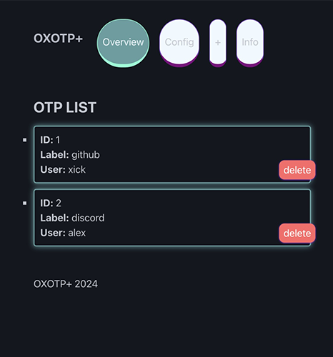
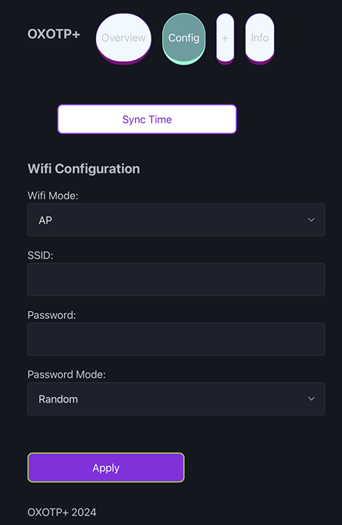
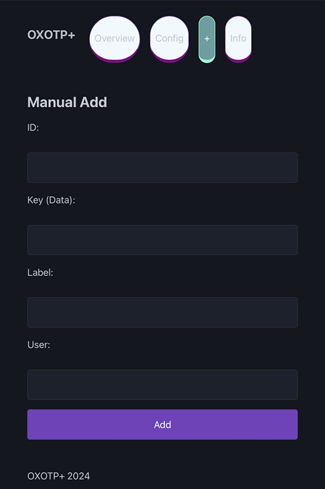

# OXOTP+

<b>FIRST OTP BASED ON M5StickCPlus / 2 for 2FA   
-------
<h3><b>⚠️This program is under active development</b> </h3>

Reimplementation of the original **OXOTP** work of @IMSHOX, with added compatibility for *M5StickCPlus* and *M5StickCPlus 2*, and a new web application.

-

## HOW TO USE
**1.** Grab the binaries for your specific board and flash it using [flash download tool](https://www.espressif.com/en/support/download/other-tools) (More info [HERE](https://github.com/xick/OXOTP-plus/blob/master/HOW.md) )    
*or*  
Build from source using Arduino IDE. [See **#HowToBuild** for more information.]    
**2.**  For the first time use, by going to the wifi settings the **SSID** and **password** of the access point to connect for the configuration will be printed on screen. Connect at this **AP** and going to address specified (for the first time should be **http://192.168.4.1/**)    
**3.** On the **configuration** section of the webapp you can also specify your router ssid and password by changing the wireless mode to host (it will automatically fallback to AP mode if connection fails)
-

**4**. Click '**Sync Time**' to setup the RTC timer of the device (be sure your system / browser time is also correct)    
**5.** Currently you can only manually add **OTPs** by providing the **secrets** of your 2FA ( a web QRCode reader functionality may come later).    
You can extract the secret keys from another authenticator app you already use, for example by using [**extract_otp_secrets**](https://github.com/scito/extract_otp_secrets).    
(Be sure the extracted secrets are in **Base32** format e.g *'OXXA6YXXVTTP4U25'*    

## HOW TO BUILD
 - Clone the repo and open *OXOTP.ino* with Arduino IDE 2.
 - Import all the dependencies: 
	 - M5Unified library
	 - ArduinoHTTPClient
	 - https://github.com/lucadentella/TOTP-Arduino
	 - https://github.com/bblanchon/ArduinoJson
	 - https://github.com/rpolitex/ArduinoNvs
- Build and flash it with Arduino IDE 2

## DEVELOPED FOR DAILY USE
OXOTP+ is intended to be used as an alternative or backup for your currently 2FA authentication app. Using a dedicated device is great because your phone can be easily lost, stolen, hacked , etc. 
Always keep a backup (even on paper) of your secrets if you intend to use this as your main 2FA system.

### MILESTONES
 - ~~Add a battery indicator~~ DONE
 - Embed a **QRCode** reader in the webapp
 - Beautify the UI, add an alternative Light UI.
 - Add **Pincode** for the webapp
 - Make poweroff timer and screen brightness tweakable.
 - Export Secrets API
 - OTA updates. 

### COMPATIBILITY
- M5StickCPLus 2
- M5StickCPlus
- M5Stick (not tested yet)

## License 

This software is licensed under the MIT License, to read the full license <a href="LICENSE" target="_blank">HERE</a>.

